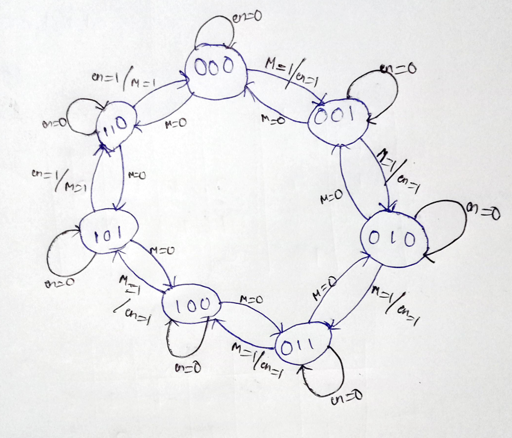
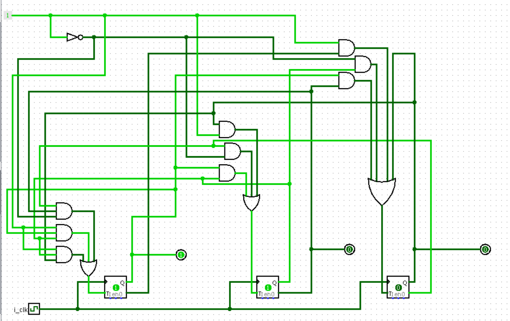

# Mod-N Conditional Up-Down Counter

## Introduction

The mod-N conditional up-down counter is a digital counter that counts up or down based on a control signal and wraps around after reaching a maximum count of N-1. It is commonly used in applications where counting within a specific range with directional control is required.

## Features

- Counts from 0 to N-1
- Up and down counting capability based on a control signal
- Synchronous operation with a clock signal
- Conditional counting based on an enable signal
- Reset functionality to initialize the counter

## Inputs

1. **Clock (i_clk)**: The primary clock signal for synchronizing the counter.
2. **Reset (i_rst)**: An asynchronous signal that resets the counter to 0 when asserted.
3. **Enable (i_en)**: A signal that enables counting when asserted. When deasserted, the counter holds its value.
4. **Up/Down (i_up_down)**: A control signal that determines the counting direction. When asserted (high), the counter counts up; when deasserted (low), the counter counts down.

## Outputs

1. **Count (o_Q)**: The current value of the counter, ranging from 0 to N-1.

## Operation

- **Counting Up**: When `i_up_down` is high and `i_en` is asserted, the counter increments its value on each rising edge of the clock.
- **Counting Down**: When `i_up_down` is low and `i_en` is asserted, the counter decrements its value on each rising edge of the clock.
- **Wrap Around**:
  - When counting up and the counter reaches N-1, it wraps around to 0 on the next clock edge.
  - When counting down and the counter reaches 0, it wraps around to N-1 on the next clock edge.
- **Hold**: When `i_en` is deasserted, the counter holds its current value regardless of the clock edges.
- **Reset**: When `i_rst` is asserted, the counter is asynchronously reset to 0, overriding all other signals.

## State Diagram
Below is the state diagram for a MOD-7 counter design.

## Waveform

Below is a output waveform demonstrating the operation of MOD-7 counter. 

## Logic Circuit

The following is the logic circuit diagram of the mod-7 conditional up-down counter using t-flipflop .

